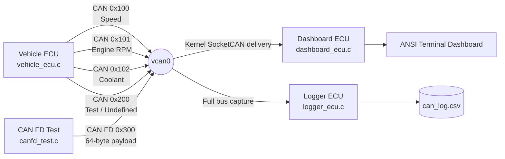
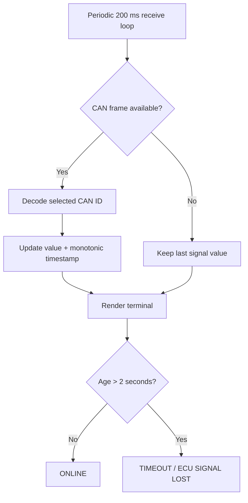

# SocketCAN Linux Vehicle ECU Simulation

A production-oriented Linux SocketCAN laboratory that models a vehicle ECU, a filtered dashboard ECU, a bus logger, and a CAN FD transmitter on a kernel-level Virtual CAN interface (`vcan0`). The project uses the Linux PF_CAN raw-socket API so the same application architecture can be moved from `vcan0` to a physical CAN interface with minimal application changes.

## Project Scope

The simulator exercises four distinct roles:

- **Vehicle ECU** generates speed, engine speed, coolant temperature, and a deliberately unhandled diagnostic/test frame.
- **Dashboard ECU** uses kernel-installed `struct can_filter` rules to receive only the three telemetry identifiers, refreshes an ANSI terminal dashboard, and marks stale signals as offline.
- **Logger ECU** listens to the full virtual bus, detects classical CAN versus CAN FD frame lengths, writes UTC ISO-8601 timestamps, and flushes each CSV record.
- **CAN FD test node** sends a 64-byte payload under CAN ID `0x300` using `struct canfd_frame` and `CAN_RAW_FD_FRAMES`.

## SocketCAN Overview

SocketCAN exposes CAN networking through Linux's normal socket model. Applications create a `PF_CAN` / `SOCK_RAW` socket, map an interface name such as `vcan0` to an interface index, bind the socket to `AF_CAN`, and then exchange `struct can_frame` objects. CAN raw filters can be installed with `setsockopt()` so unwanted traffic is discarded in the kernel before it reaches the application.

The virtual CAN driver is useful for deterministic development because it creates a software-only CAN interface. No CAN controller, transceiver, or physical wiring is required. Multiple applications can bind the same virtual bus and observe the same frames.

## System Architecture



## Data Flow & Processing Pipeline

```mermaid
flowchart TD
    A[Generate physical telemetry] --> B[Scale and encode little-endian payload]
    B --> C[Build struct can_frame]
    C --> D[write() to PF_CAN raw socket]
    D --> E[(vcan0)]
    E --> F{Kernel CAN ID filtering}
    F -->|0x100 / 0x101 / 0x102| G[Dashboard decode]
    F -->|Other IDs| H[Not delivered to dashboard]
    E --> I[Logger capture]
    I --> J{Frame length}
    J -->|16 bytes| K[Classical CAN parser]
    J -->|72 bytes| L[CAN FD parser]
    K --> M[Hex formatting + UTC timestamp]
    L --> M
    M --> N[fflush()]
    N --> O[(can_log.csv)]
```

## Dashboard Diagnostic Flow



## CAN Message Definitions

All multi-byte scalar values use **little-endian** encoding: byte 0 is the least significant byte.

| CAN ID | Signal | Payload Size | DLC | Range / Scale | Description |
| --- | --- | ---: | ---: | --- | --- |
| `0x100` | Vehicle speed | 2 bytes | 2 | `0.1 km/h/bit`, 0 to 180.0 km/h | Periodic vehicle speed telemetry |
| `0x101` | Engine RPM | 2 bytes | 2 | `1 rpm/bit`, 700 to 6500 rpm | Periodic engine rotational speed |
| `0x102` | Coolant temperature | 2 bytes | 2 | `0.1 °C/bit`, -40 to 140 °C | Signed temperature telemetry |
| `0x200` | Test / undefined | 8 bytes | 8 | Raw bytes | Intentionally not subscribed to by dashboard |
| `0x300` | CAN FD test payload | 64 bytes | 64 | Raw bytes | Capacity/scalability experiment |

### Endianness Example

For speed `83.4 km/h`, the transmitted engineering value is `834` decimal = `0x0342`. The bus payload is therefore:

```text
Byte 0 = 0x42
Byte 1 = 0x03
```

The receiver reconstructs the integer with:

```text
value = byte[0] | (byte[1] << 8)
```

## Source File Responsibilities

### `vehicle_ecu.c`

The vehicle simulator binds to `vcan0`, produces deterministic but non-constant telemetry from bounded mathematical waveforms, scales engineering values to integer wire representations, and periodically transmits standard 8-byte-capable CAN frames. The undefined `0x200` frame is emitted every five seconds so the logger sees traffic that the dashboard intentionally ignores.

### `dashboard_ecu.c`

The dashboard uses the SocketCAN raw API and installs kernel filters for `0x100`, `0x101`, and `0x102`. Incoming frames are decoded without a user-space scan through unrelated traffic. A monotonic clock records the last update time for every signal, and a two-second freshness threshold produces a visible timeout diagnostic after the vehicle sender disappears.

### `logger_ecu.c`

The logger enables `CAN_RAW_FD_FRAMES`, allowing the same receive socket to observe classic CAN and CAN FD traffic. It distinguishes the two by the returned frame size, converts payload bytes into a space-separated hexadecimal string, stores an UTC timestamp, and calls `fflush()` after each record to minimize loss if the process stops unexpectedly.

### `canfd_test.c`

The CAN FD test application uses `struct canfd_frame` with a 64-byte payload and enables `CAN_RAW_FD_FRAMES`. The first bytes identify the test stream, a sequence counter makes each message traceable, and the final byte provides a lightweight deterministic integrity marker for analysis.

## Results of Learning Challenges

### Challenge 1: Simultaneous Traffic Observation

Run `vehicle_ecu`, `dashboard_ecu`, and `logger_ecu` concurrently. `vcan0` behaves as a shared software bus, so the same transmitted CAN frame can be consumed independently by multiple sockets. The dashboard presents a processed view while the logger preserves a bus-level record. A separate `candump vcan0` process can independently observe the same traffic.

**Observation:** one transmission does not require point-to-point addressing. The bus is broadcast-oriented, and multiple listeners can subscribe concurrently.

**Engineering conclusion:** separating operational consumers from forensic logging is practical because SocketCAN supports multiple raw sockets without requiring application-level forwarding.

### Challenge 2: Kernel-Level Message Filtering

The dashboard installs three `struct can_filter` entries with `CAN_RAW_FILTER`. Because the filter is applied by the kernel, `0x200` test frames are not passed to the dashboard receive loop even though they remain visible to the logger and `candump`.

**Observation:** the dashboard application processes only the signals that matter to its functional domain.

**Engineering conclusion:** kernel filtering reduces unnecessary user-space wakeups and parsing work and makes acceptance criteria explicit at the socket boundary.

### Challenge 3: Undefined CAN Frame Detection

`0x200` is intentionally emitted by the vehicle ECU but is not part of the dashboard's subscription set. The logger still records it, demonstrating the difference between **bus visibility** and **application subscription**.

**Observation:** an unhandled frame is not equivalent to an invisible frame.

**Engineering conclusion:** diagnostics and logging nodes can provide broader observability than a functional ECU while higher-level ECUs maintain strict message ownership.

### Challenge 4: Transmission Rate Variations

The simulation intentionally uses different production rates: speed and RPM at approximately 10 Hz, coolant at approximately 4 Hz, and the test frame at approximately 0.2 Hz. This produces mixed traffic frequencies without generating excessive host CPU load.

**Observation:** each signal can have its own timing budget rather than forcing every signal into a single fixed period.

**Engineering conclusion:** real vehicle networks commonly assign update rates according to control relevance, bandwidth budget, and diagnostic requirements. The mixed-rate model exposes how logger volume and receiver wakeups change when a producer frequency is increased.

### Challenge 5: Node Disconnection & Failure Analysis

Stop `vehicle_ecu` while keeping the dashboard and logger running. The dashboard retains the last values but, after the freshness threshold expires, marks every affected signal as `TIMEOUT`.

**Observation:** absence of traffic is itself diagnostic information; the last good value should not be interpreted as current forever.

**Engineering conclusion:** production systems typically combine last-seen timestamps with application-level supervision rather than relying on the socket simply blocking indefinitely.

### Challenge 6: CAN FD Implementation

`canfd_test.c` sends `struct canfd_frame` objects with 64 bytes of payload under `0x300`. CAN FD increases payload capacity compared with classical CAN's eight-byte maximum, making it suitable for richer diagnostics, firmware transport, and sensor payload aggregation.

**Observation:** the logger can distinguish a classic CAN frame from a CAN FD frame by the size returned by `read()` when `CAN_RAW_FD_FRAMES` is enabled.

**Engineering conclusion:** enabling FD support in the raw socket is not sufficient by itself; every application that shares the path must also understand the larger frame object and payload length semantics.

### Challenge 7: ECU Offline Diagnostic Detection

The dashboard uses `CLOCK_MONOTONIC` for timeout supervision, avoiding problems caused by wall-clock changes. Each signal stores its most recent receive time. When the elapsed time exceeds two seconds, the dashboard reports the signal as offline.

**Observation:** health monitoring becomes deterministic even when the system clock is adjusted.

**Engineering conclusion:** timeout supervision should use a monotonic timebase, separate freshness state from displayed signal values, and define a threshold consistent with the message period plus allowed jitter.

## Classical CAN vs CAN FD Analysis

| Property | Classical CAN | CAN FD |
| --- | --- | --- |
| Maximum payload | 8 bytes | 64 bytes |
| Linux structure | `struct can_frame` | `struct canfd_frame` |
| Socket option | Standard raw CAN | `CAN_RAW_FD_FRAMES` required for FD-capable socket |
| Typical use | Fast control telemetry | Diagnostics, larger sensor data, data transport |
| Payload efficiency for large records | Lower | Higher |
| Compatibility requirement | Legacy CAN controllers | FD-capable controller/network path required |

For this simulation, `0x300` is treated as a CAN FD test identifier. A physical CAN FD bus also requires a CAN FD-capable controller/interface and appropriate bus configuration; `vcan0` is a software development mechanism and does not reproduce every physical-layer timing constraint.

## Key Learnings & Engineering Takeaways

1. SocketCAN makes CAN messaging look like ordinary Linux socket I/O while preserving CAN-specific framing and filtering semantics.
2. `vcan0` is an effective test harness for multi-process CAN applications because it requires no external hardware.
3. Kernel-side filtering is preferable when an ECU has a small, fixed message contract.
4. Broadcast traffic can be observed by independent operational, diagnostic, and logging nodes.
5. Timeout logic should be based on monotonic time and a defined freshness budget.
6. CAN FD expands payload capacity but requires explicit application awareness of the larger frame representation.
7. Deterministic encoding rules, documented scales, and explicit byte order are essential for interoperability.

# Execution & Run Guide

## 1. Virtual CAN Interface Initialization

Install build tools and CAN utilities on Debian/Ubuntu:

```bash
sudo apt update
sudo apt install -y build-essential can-utils git
```

Load the Virtual CAN kernel module and create the interface:

```bash
sudo modprobe vcan
sudo ip link add dev vcan0 type vcan
sudo ip link set up vcan0
ip -details link show vcan0
```

If `vcan0` already exists, use:

```bash
sudo ip link set up vcan0
```

To remove it later:

```bash
sudo ip link delete vcan0
```

## 2. Compilation Instructions

Compile with the project Makefile:

```bash
make
```

Equivalent explicit GCC commands:

```bash
gcc -std=c11 -Wall -Wextra -Wpedantic -O2 -o vehicle_ecu vehicle_ecu.c -lm
gcc -std=c11 -Wall -Wextra -Wpedantic -O2 -o dashboard_ecu dashboard_ecu.c
gcc -std=c11 -Wall -Wextra -Wpedantic -O2 -o logger_ecu logger_ecu.c
gcc -std=c11 -Wall -Wextra -Wpedantic -O2 -o canfd_test canfd_test.c
```

Clean generated binaries and logs:

```bash
make clean
```

## 3. Synchronized Execution Sequence

Use four or five terminals.

### Terminal 1 — Bus monitor

```bash
candump -tz vcan0
```

### Terminal 2 — Logger ECU

```bash
./logger_ecu
```

### Terminal 3 — Dashboard ECU

```bash
./dashboard_ecu
```

### Terminal 4 — Vehicle ECU

```bash
./vehicle_ecu
```

### Optional Terminal 5 — CAN FD test

```bash
./canfd_test
```

The expected behavior is:

- `candump` shows `0x100`, `0x101`, `0x102`, periodic `0x200`, and `0x300` when the CAN FD test runs.
- The dashboard displays only `0x100`, `0x101`, and `0x102`.
- `can_log.csv` contains all observed classic CAN traffic plus CAN FD frames.
- Stopping `vehicle_ecu` makes the dashboard report signal timeouts after approximately two seconds.

## 4. Verification with `cansend`

You can manually inject a speed frame:

```bash
cansend vcan0 100#4203
```

The dashboard interprets this as `0x0342 = 834`, scaled by `0.1 km/h/bit`, therefore `83.4 km/h`.

Inject an RPM frame:

```bash
cansend vcan0 101#7017
```

Inject a coolant frame representing `95.0 °C` (`950 = 0x03B6`):

```bash
cansend vcan0 102#B603
```

Inject the deliberately unhandled test ID:

```bash
cansend vcan0 200#A501005AC3C37E
```

The dashboard should ignore `0x200`, while `candump` and the logger should observe it.

## 5. CAN FD Interface Notes

The CAN FD test uses a 64-byte payload. The `logger_ecu` application enables `CAN_RAW_FD_FRAMES` so it can accept both classic CAN and CAN FD frames. On Linux versions/configurations where `vcan` is not available or lacks the desired FD test behavior, consult the local kernel's virtual CAN configuration and SocketCAN documentation before substituting a physical CAN FD interface.

# GitHub Deployment Guide

Replace the placeholders before running the commands:

- `(GITHUB_USERNAME)` = your GitHub handle.
- `(REPO_NAME)` = your GitHub repository name, for example `SocketCAN-Linux-Simulation`.
- `(BRANCH_NAME)` = normally `main`.

## Step-by-Step Git CLI Commands

From the project directory:

```bash
git init
git branch -M main

git add vehicle_ecu.c dashboard_ecu.c logger_ecu.c canfd_test.c README.md Makefile .gitignore
git status
git commit -m "Add SocketCAN multi-ECU simulation"
```

Create the remote repository on GitHub with the desired repository name. Then connect the local repository:

```bash
git remote add origin https://github.com/(GITHUB_USERNAME)/(REPO_NAME).git
git remote -v
git push -u origin (BRANCH_NAME)
```

For SSH-based authentication instead:

```bash
git remote remove origin 2>/dev/null || true
git remote add origin git@github.com:(GITHUB_USERNAME)/(REPO_NAME).git
git push -u origin (BRANCH_NAME)
```

Future updates:

```bash
git add .
git commit -m "Update SocketCAN simulation"
git push
```

## Recommended Repository Validation Before Push

```bash
make clean
make
./vehicle_ecu --help 2>/dev/null || true
git status
```

The programs intentionally use a fixed interface name `vcan0`, matching the assignment specification. To adapt the code to another interface, replace the `CAN_INTERFACE` definition in each source file or parameterize it as a command-line argument in a future extension.

## Troubleshooting

### `SIOCGIFINDEX: No such device`

The application cannot see `vcan0`. Recreate or re-enable it:

```bash
sudo modprobe vcan
sudo ip link add dev vcan0 type vcan 2>/dev/null || true
sudo ip link set up vcan0
```

### Dashboard remains in timeout

Verify the vehicle process is transmitting and inspect the bus:

```bash
candump vcan0
```

### Logger does not record CAN FD frames

Confirm the test process is using CAN FD and that the logger has successfully enabled `CAN_RAW_FD_FRAMES`. Also verify the local kernel's vcan/CAN FD support.

### `can-utils` command not found

Install it:

```bash
sudo apt install -y can-utils
```

# License

Use this project as an educational and engineering test harness. Add the license and copyright policy required by your organization or course before public redistribution.
